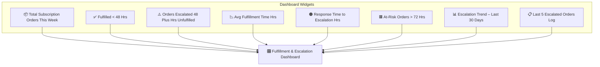

# Dashboard Mockup: Fulfillment & Escalation Tracking

---

## 📌 Widget Descriptions

- **📦 Total Subscription Orders This Week**  
  Total count of new subscription orders placed in the past 7 days.

- **✅ Fulfilled < 48 Hrs**  
  How many of those orders were fulfilled within SLA.

- **⚠️ Orders Escalated (48+ Hrs)**  
  Number of orders that triggered the escalation SOP.

- **📉 Avg Fulfillment Time (Hrs)**  
  Average time from order placement to fulfillment.

- **🟠 Response Time to Escalation (Hrs)**  
  Time taken by support/VA to respond once an alert is triggered.

- **🟥 At-Risk Orders > 72 Hrs**  
  Critical queue of unfulfilled subscription orders older than 72 hours.

- **📊 Escalation Trend – Last 30 Days**  
  Bar or line chart showing escalation counts by day/week.

- **📋 Last 5 Escalated Orders Log**  
  Quick reference to Order ID, Customer, Tier, and Escalation Date.
