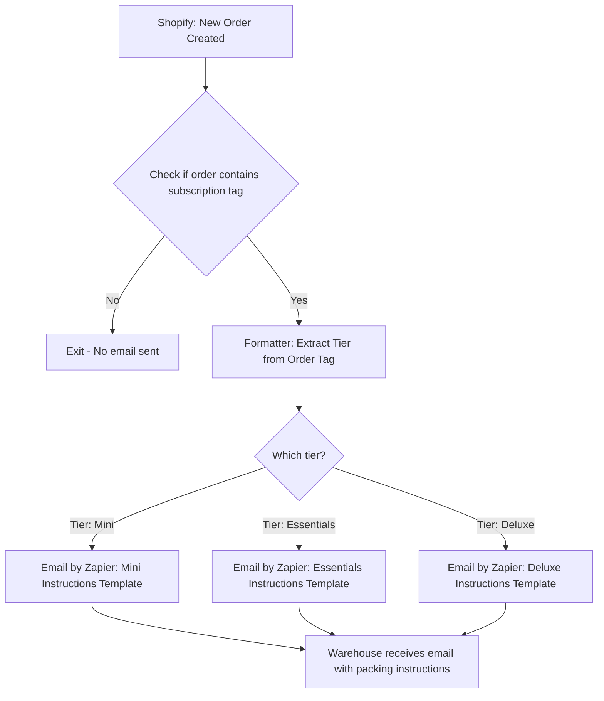

# Zapier Flow Map: Tier-Based Fulfillment Email

## 🧩 Component Summary

| Step | Tool | Description |
|------|------|-------------|
| A | Shopify (Trigger) | Order created webhook |
| B | Filter (Zapier) | Check for tag: Tier: Mini, Essentials, or Deluxe |
| D | Formatter (Zapier) | Parse tag to identify tier |
| F/G/H | Email by Zapier (or Gmail/SendGrid) | Send customized instructions |
| I | N/A | Email lands in warehouse@lunaluxenaturals.com inbox |
