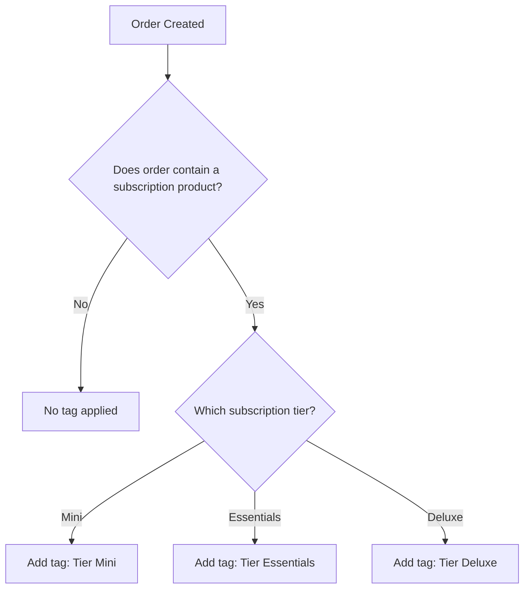

# Flowchart: Order Tier Tagging Logic

```mermaid
flowchart TD
    A[Order Created] --> B{Does order contain a subscription product?}
    B -- No --> C[No tag applied]
    B -- Yes --> D{Which subscription tier?}
    D -- Mini --> E[Add tag: Tier Mini]
    D -- Essentials --> F[Add tag: Tier Essentials]
    D -- Deluxe --> G[Add tag: Tier Deluxe]
```

